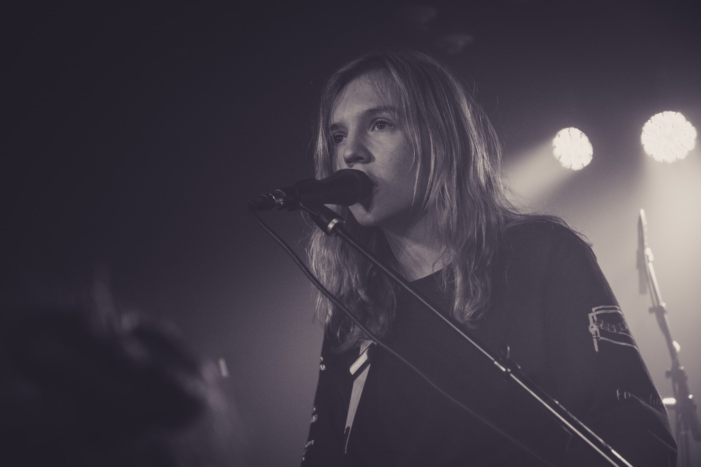

Passion Projects are focused, 3-month projects for experienced students who want to work together to achieve a specific goal.
{: .lead}

{: .img-fluid .rounded}
<small class="d-block text-right">Photo by <a href="https://unsplash.com/@potato62047?utm_source=unsplash&amp;utm_medium=referral&amp;utm_content=creditCopyText">Cody Schneider</a> on <a href="https://unsplash.com/s/photos/singing-on-stage?utm_source=unsplash&amp;utm_medium=referral&amp;utm_content=creditCopyText">Unsplash</a></small>

On this page:
- [What's it all about?](#whats-it-all-about)
- [Who is this a good fit for?](#who-is-this-a-good-fit-for)
- [What does a project include?](#what-does-a-project-include)
- [How much does it cost?](#how-much-does-it-cost)
- [Where do we meet?](#where-do-we-meet)
- [What if I have more questions?](#what-if-i-have-more-questions)

## What's it all about?

Passion Projects are all about you and what you want to accomplish with your piano playing and overall music education. What's your goal? As your creative coach, I will help you decide on and work toward an outcome that is meaningful to you.

This approach requires a firm commitment and intense focus for a 3-month timeline during which we'll meet on a regular basis for both demonstration of your progress and short check-ins to answer questions and keep you on track. We'll also collaborate offline through chat and sharing other resources and materials to support you in your goal.

### What are some examples of Passion Projects?

These are just some examples. At the beginning of the project, I'll help you come up with a challenging goal that is meaningful to you. Depending on your goal, I'll help you learn the appropriate skills along the way from a variety of sources.

- Record a 3-song demo on GarageBand.
- Play and sing all Taylor Swift's songs off her new album.
- Audition for a show, gig, or theatrical production.
- Write songs for a musical or arrange music for a film production.
- Accompany my community choir group.
- Play holiday music at family gatherings.

## Who is this a good fit for?

This approach to learning piano requires more self-motivation than your typical piano lessons.

A good-fit student is someone who sounds like the following:

- Loves to figure out how to play their favorite songs on piano.
- Learns by listening to music frequently and intently.
- Loves to show off when they've learned a song.
- Isn't afraid to try new things and be creative.
- Imagines themselves doing fun things with music.
- Somewhere between the ages of 10 and 100 years old.

My expertise is in playing and singing popular music on piano. I emphasize  playing by ear and building a foundation of rhythm, melody, and harmony using a chord-based approach. I can also teach you how to branch out into songwriting, arranging, or producing music to picture for those who are interested in exploring these arenas.

## What does a project include?

Each project will run for 3 months and includes the following:

- Weekly, 1-hour lesson
- Weekly, 30-minute check-in
- Personalized project goal
- Personalized at-home practice plan
- Intermittent offline communication as needed

Note: A project can start any time; there are no seasonal start/end dates. We can schedule the meeting times to occur regularly but the schedule can be fluid as needed.

## How much does it cost?

All pricing is on a *per-project* basis. (There is no option for individual or ongoing meetings/lessons.)

If paid upfront:

- 3-month project: $1,000 (*Save $200 with this option!*)

If paid in monthly installments at the beginning of each month:

- 1 month: $400 (*3 months x $400 = $1200 total*)

Payment can be made by cash, check, PayPal, or Zelle.

## Where do we meet?

Meetings will primarily take place online using Zoom for now. For students who are local to Woodbridge, Va., we may be able to do some in-person meetings, but we will talk first about COVID precautions.

These are the technical requirements:
- Piano or keyboard
- Computer or phone with Zoom app installed
- Google account (for Google Classroom)
- Fast, reliable internet connection
- Notebook and pen/pencil

Some nice-to-haves:
- Separate microphones for piano and voice
- Separate device cameras for piano and face

## What if I have more questions?

No problem! [Send me an email](mailto:sophia@sophiamusicstudio.com) with any questions you have. Or [find me on Facebook](https://www.facebook.com/SophiaMusicStudio/).

[Back to top 👆](#)